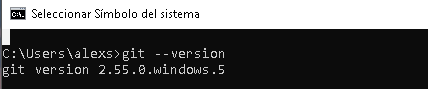
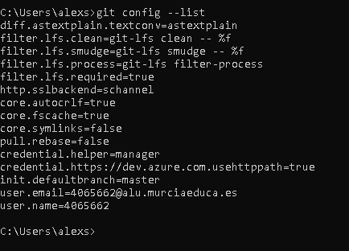
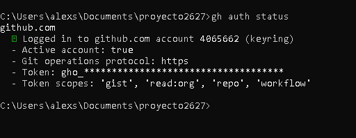
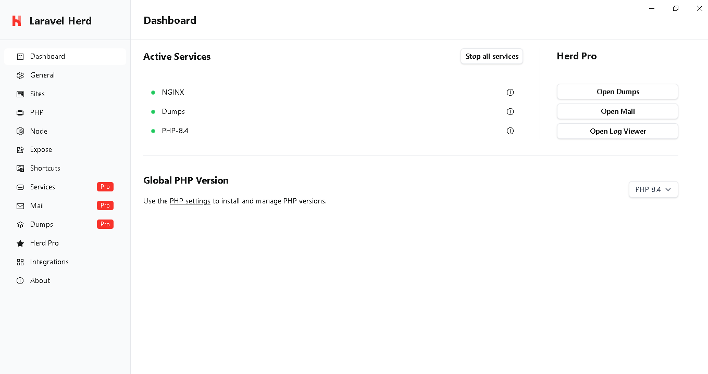
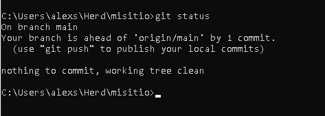
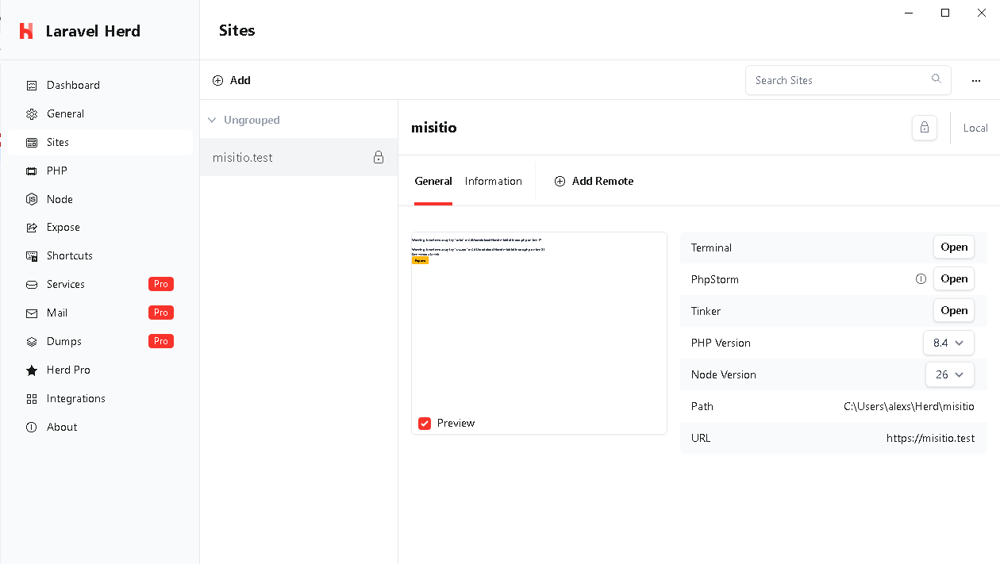

# Práctica 01 - Documentación
## PASO 1: Git instalado y configurado en local
#### Con el comando "git --version" muestro que tengo git instalado 

-- 
#### Con el comando "git config -list" se puede ver que está configurado.

## PASO 2: GitHub CLI instalado y configurado.
#### Con el comando "gh auth status" muestro la información requerida.

## PASO 3: Herd instalado con la versión de PHP 8.4.
#### En "Active services" podemos observar la versión.

## PASO 4: repositorio "misitio" clonado en local
#### Con el comando "git status" vemos como está clonado.

## PASO 5: Herd enlazado al repositorio "misitio" y sirviéndolo en  HTTPS.
#### La información requerida se muestra en el apartado path y url.
